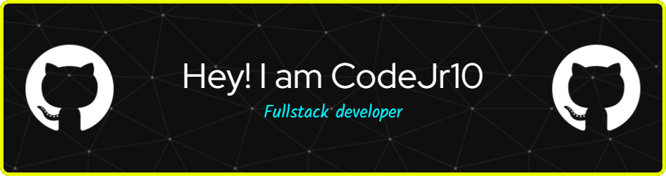

  

    
  <strong>Hey 👋, I'm Aaditya Malap!</strong>

  
  
    

  

---
## 🛠️ Languages and Tools  

  
  
  
  
  
  
  
  
  
  
  
  
  
  
  
  
  
  
  
  
  
  
  

---

&nbsp;***Github Stats***

 

  

---

### 🌐 Let's Connect

Feel free to connect with me on GitHub or LinkedIn!
- 📫 Reach out to me at: <a href="crce.9754.ecsgmail.com">crce.9754.ecs@gmail.com</a>

